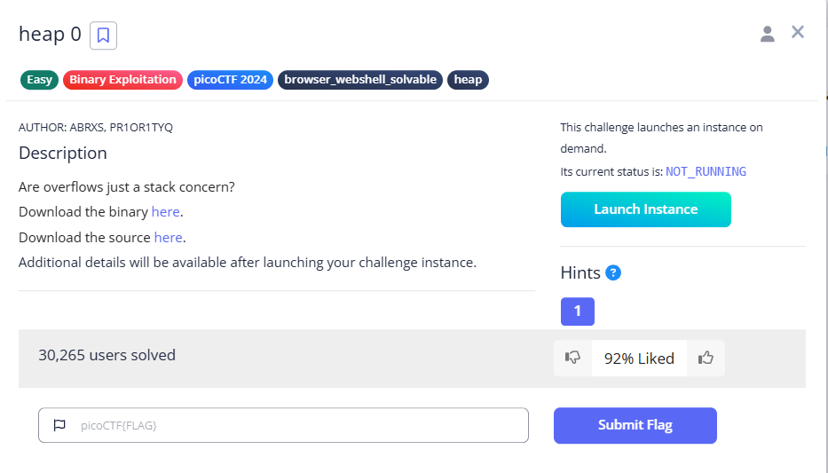
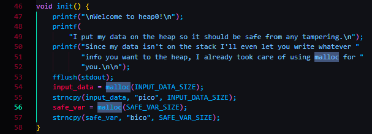
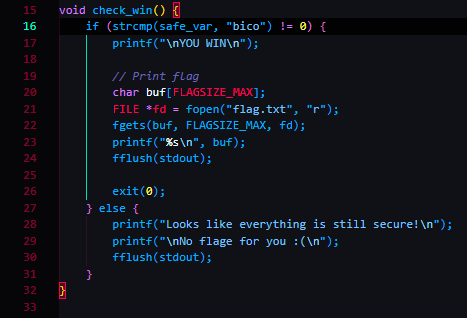
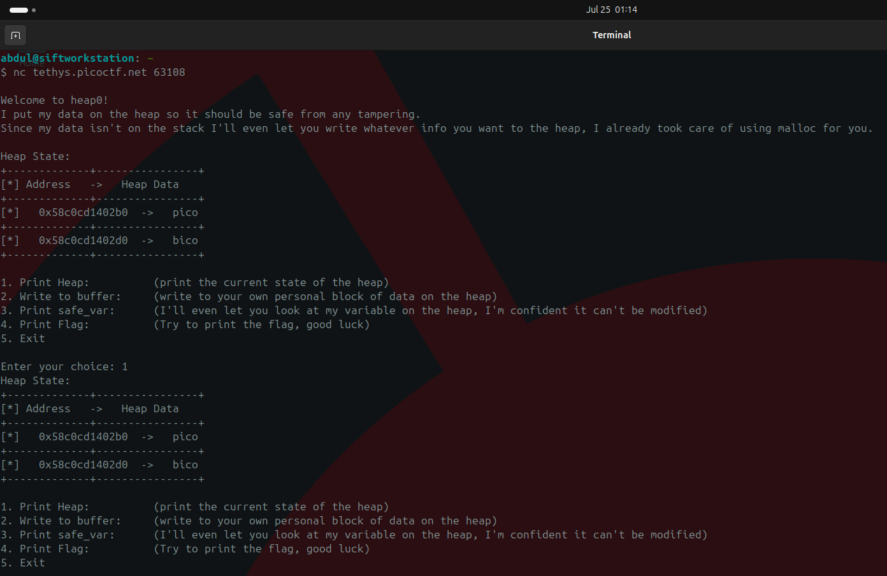
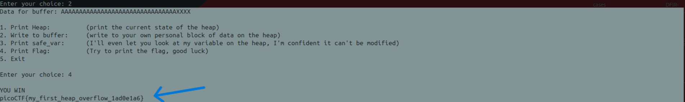

**Attached files:** `chall` (binary) | `chall.c` (source)
<div class="page-break" style="page-break-before: always;"></div>

1. **Skim the source.**  
    Reading `chall.c` shows two consecutive `malloc` calls: the program first allocates **`input_data`** and immediately afterwards allocates **`safe_var`**.  
    Later, the flag is printed only if `safe_var` is _not_ equal to the string **"bico"**.  
    This already hints that overflowing `input_data` is the intended route.


2. **Let the program leak its own heap.**  
    connecting to the instance – `nc tethys.picoctf.net 63108`– and choosing **“1 Print Heap”** to confirm the heap state yields this:

The first address is `input_data`; the second is `safe_var`. Subtracting them shows a **32-byte (0x20) gap**: 
$$
 0x58c0cd1402d0 - 0x58c0cd1402b0 = 32
$$
Why 32? glibc stores a 16-byte header in front of each chunk and rounds the user area up to 16 bytes, so `0x10 (header) + 0x10 (aligned user area) = 0x20` bytes between the two user pointers.

3. **Craft the payload.**  
    All we need is
    - **32 padding bytes** to stride over the header/alignment, then
    - **any string different from `"bico"`**.
    Example payload (36 bytes total):
```
AAAAAAAAAAAAAAAAAAAAAAAAAAAAAAAAXXXX
```

4. **Exploit steps.**

Writing those 36 bytes overflows `input_data`; the first 32 bytes land in unused padding and the second chunk’s header, while the trailing “hack” overwrites `safe_var`. Because `safe_var` no longer equals “bico”, the flag routine triggers.

Flag: `picoCTF{my_first_heap_overflow_1ad0e1a6}**`

