Attached files:
`Hero.unknown` — some form of unknown ASCII text (implied to be disassembled code)
`flag.enc` — a JSON file with a long list of large negative integers.
<div class="page-break" style="page-break-before: always;"></div>

### **Initial Recon**
```
$ file Hero.unknown
Hero.unknown: ASCII text

$ file flag.enc
flag.enc: JSON data
```

Peeking inside:
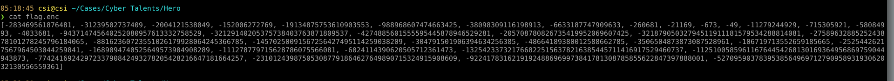
Then
```bash
cat Hero.unknown
```

That last part was the clue that gave it away. I recognized the structure: `LOAD_CONST`, `MAKE_FUNCTION`, etc… It was disassembled Python bytecode, likely produced with the `dis` module. So the actual obfuscation logic was right there. All we needed to do was understand what it was doing, then invert it.

### **Understanding `Hero.unknown`**
### 1. Function Definitions
#### `gen(i): return i ^ 11`
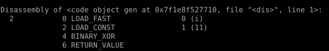
This means:
- Load argument `i`
- Load constant `11`
- XOR them → `i ^ 11`
- Return result

#### `gen2(i): return 14 ** i`
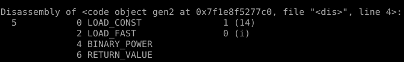
This means:
- Load constant `14`
- Load argument `i`
- Compute `14 ** i`
- Return result    
<div class="page-break" style="page-break-before: always;"></div>

### 2. Main Routine
Now parse the bytecode of the main execution step by step.

#### Lines 1–6: Function Definitions
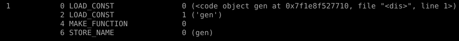
Creates and stores function `gen`.

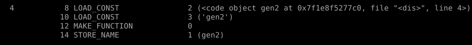
Creates and stores function `gen2`.

#### Lines 7–9: Read flag.txt and convert to list of ASCII values
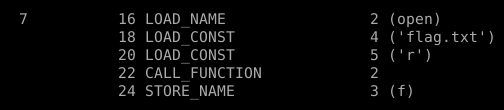
Opens `flag.txt` for reading, stores file object as `f`.

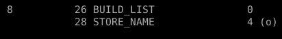
Initializes empty list `o`.

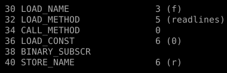
Reads all lines from the file → `f.readlines()`, then grabs the first line with `[0]` → stored as `r`.
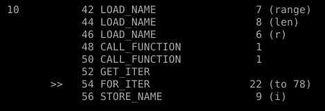
For loop over each index `i` in `range(len(r))`.
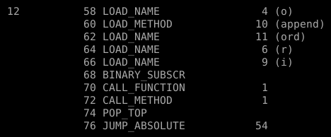
For each character at `r[i]`:
- Get its ASCII value with `ord(r[i])`
- Append to list `o`

⮕ So now `o = [ord(c) for c in r]`

What’s Happening So Far:
- Read first line from `flag.txt`
- Convert each character into its ASCII value
- Store in list `o`
<div class="page-break" style="page-break-before: always;"></div>

#### Lines 14–20: Obfuscation
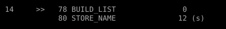
Creates a new empty list `s` (output list of encrypted values).

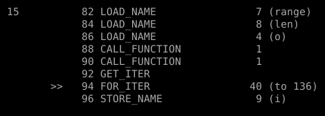
Loop over each index `i` in `range(len(o))`

Inside the loop:
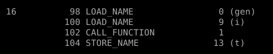
`t = gen(i)` → XOR `i ^ 11`
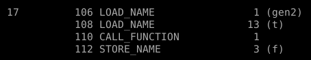
`f = gen2(t)` → `14 ** (i ^ 11)`
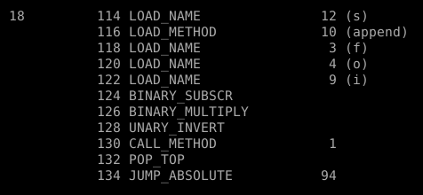

Now comes the obfuscation:
```python
val = f * o[i]        # Multiply 14^(i ^ 11) * ord(flag[i])
val = ~val            # Bitwise NOT
s.append(val)
```
This is how the `flag.enc` values were created.
#### Line 20–21: Output
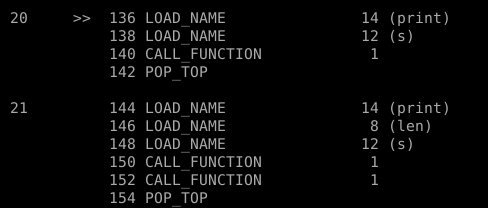
Just prints `s` and its length. Not important to us.

## Final Formula
With this understanding, the logic of the encryption is:
```python
for i, c in enumerate(flag_line):
    t = i ^ 11
    f = 14 ** t
    encrypted = ~(f * ord(c))
    s.append(encrypted)
```

So to reverse it:
```python
original_char = chr((~encrypted_value) // (14 ** (i ^ 11)))
```

And that’s how I got the flag back.
<div class="page-break" style="page-break-before: always;"></div>

### 🛠 Reversing the Obfuscation

Here's the final script I wrote to undo it:
```python
import json

with open('flag.enc', 'r') as f:
    encrypted = json.load(f)

def gen(i):
    return i ^ 11

def gen2(i):
    return 14 ** i

flag_chars = []

for i, val in enumerate(encrypted):
    power = gen2(gen(i))
    ch = (~val) // power
    flag_chars.append(chr(ch))

flag = ''.join(flag_chars)
print("Recovered Flag:", flag)
```

### Output
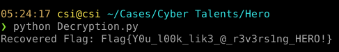
```
Recovered Flag: Flag{Y0u_l00k_lik3_@_r3v3rs1ng_HERO!}
```
And there it was — clear as day.
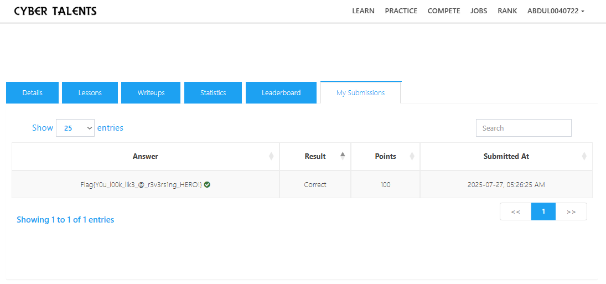
