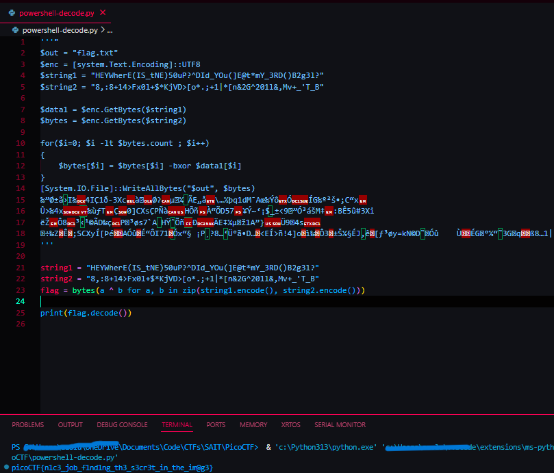
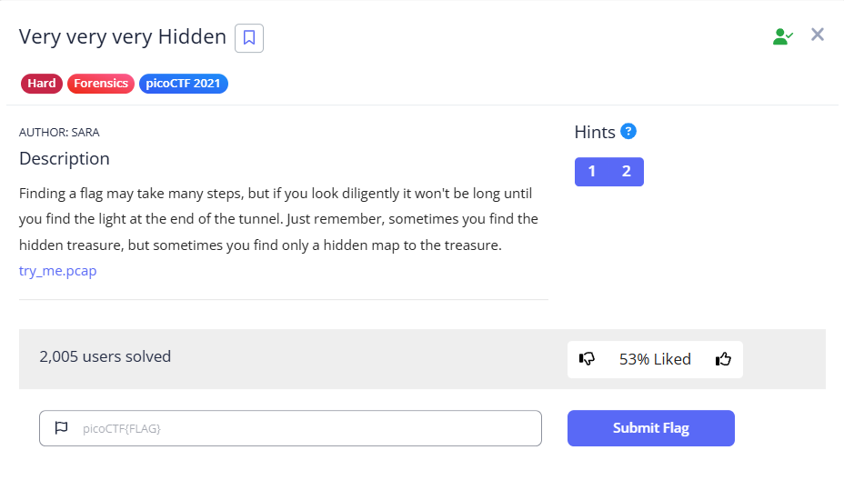

<div class="page-break" style="page-break-before: always;"></div>

### 1. Open the capture and focus on clear-text traffic
99 % of frames are TLS noise; the interesting bits are the handful of vanilla-HTTP requests. Load `try_me.pcap` in wireshark and apply
```wireshark
(http.request or ssl.handshake.type == 1) and !(udp.port == 1900)
```

Five HTTP requests remain; two of them fetch images from an AWS host:
```
GET /NothingSus/duck.png HTTP/1.1
GET /NothingSus/evil_duck.png HTTP/1.1
```

### 2. Export the objects
`File ▸ Export Objects ▸ HTTP ▸ Save All`  
Now we have `duck.png` (≈ 45 kB) and **`evil_duck.png` (≈ 2.6 MB)** on disk.

### 3. Identify the hiding method
A sweep with `binwalk`, `zsteg`, `steghide`, etc. comes up blank.  
So next, I look at the browsing history we captured. Among the HTTPS SNI fields there’s a `powershell.org`. That, plus a gigantic PNG, screams **PowerShell/Invoke-PSImage** steganography.

### 4. Extract the hidden PowerShell payload
Any Invoke-PSImage decoder works; the Windows-friendly binary in **PCsXcetra/Decode_PS_Stego** is the easiest drop-in tool, you can get it here [here](https://github.com/PCsXcetra/Decode_PS_Stego), after which you can run the following:
```bash
.\PowershellStegoDecode.exe
```

The decoder spits out a script
```powershell
$out = "flag.txt"
$enc = [system.Text.Encoding]::UTF8

$string1 = "HEYWherE(IS_tNE)50uP?^DId_YOu(]E@t*mY_3RD()B2g3l?"
$string2 = "8,:8+14>Fx0l+$*KjVD>[o*.;+1|*[n&2G^201l&,Mv+_'T_B"

$data1 = $enc.GetBytes($string1)
$bytes = $enc.GetBytes($string2)
for($i=0; $i -lt $bytes.count ; $i++)
{
    $bytes[$i] = $bytes[$i] -bxor $data1[$i]
}
[System.IO.File]::WriteAllBytes("$out", $bytes)
‰”رã›I‰4IÇ1ð-3XcàØ?µ¼ ÃE„å\…½þq1dM¯Aœ‰ÝôÓÍG‰º²š•;C“x
Û>‰4x‰ùƒTÇ0]CXsÇPÑàHÕñÀ“ÕD57¥Ý~‘¡$­_±<9”Ó³ášM‡:BÊ5û#3Xi
ëŽÔ8³‹¹©ÃD‰çP³øs7`A HŸˆÕñÐÄE‡¼µž1A”}Ü94s
÷‰ZÊ;SCXyÍ[ÞéAÓûÉ“ÔI71­Óx“§ ¡P¸?8…‘Ü°ã•D…<EÍ>ñ!4]oì‰Ô3±Š½§ÉJ‚ê[ƒ³øy=kN©D˜Óû    ÙÉG°½“˜3Gqß8…1|
```
<div class="page-break" style="page-break-before: always;"></div>

### 5. Recover the flag
I run this python script to get the flag
```python
s1 = b"HEYWherE(IS_tNE)50uP?^DId_YOu(]E@t*mY_3RD()B2g3l?"
s2 = b"8,:8+14>Fx0l+$*KjVD>[o*.;+1|*[n&2G^201l&,Mv+_'T_B"
flag = bytes(a ^ b for a, b in zip(s1, s2))
print(flag.decode())
```

Output:

```
picoCTF{n1c3_job_f1nd1ng_th3_s3cr3t_in_the_im@g3}
```

