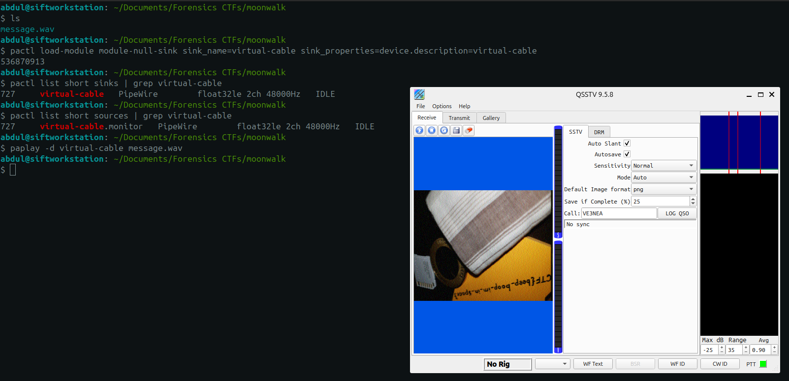

Attached File: `message.wav`
<div class="page-break" style="page-break-before: always;"></div>

## 1. Lab Setup
> Tested on an SIFT Ubuntu 22.04 VM running PipeWire (PulseAudio compatibility layer). Substitute equivalent commands on other distros.

### 1.1 Grab the tools
```bash
sudo apt update
sudo apt install qsstv pavucontrol
```
- `qsstv` – GUI SSTV receiver/encoder.
- `pavucontrol` – lets us reroute audio sources and sinks (needed for a virtual cable).

### 1.2 Create a virtual audio cable

QSSTV expects real-time audio; we’ll feed the WAV straight into it via a null sink:
```bash
#  a) remove any existing null sink (optional reset)
pactl unload-module module-null-sink || true
```

```bash
#  b) create a fresh one
pactl load-module module-null-sink sink_name=virtual-cable sink_properties=device.description=virtual-cable
```

Verify:
```bash
pactl list short sinks   | grep virtual-cable   # should list the sink
pactl list short sources | grep virtual-cable   # should list virtual-cable.monitor
```

## 2. Configure QSSTV

1. **Launch QSSTV**.
2. _Options → Configuration → Sound_
    - Interface: **PulseAudio**
    - Input device: **pulse – PulseAudio Sound Server**
    - Input clock: **48000 Hz** (matches the file’s sample rate)
    - Save & OK.
3. Return to the main window; set **mode** to **Auto** via the toolbar dropdown.

## 3. Wire the Audio Path
1. Start `pavucontrol`.
2. Go to **Recording**
3. Change its source to **Monitor of virtual-cable Audio/Sink sink**.
4. In a terminal, play the sample **into** the virtual cable:
```bash
paplay -d virtual-cable message.wav
```
The QSSTV waterfall should immediately light up with the distinct SSTV stripe pattern.
<div class="page-break" style="page-break-before: always;"></div>

## 4. Extract

Let the entire Scottie 1 frame (~110 s) paint. When the last line renders the final image shows:

```
picoCTF{beep_boop_im_in_space}
```

